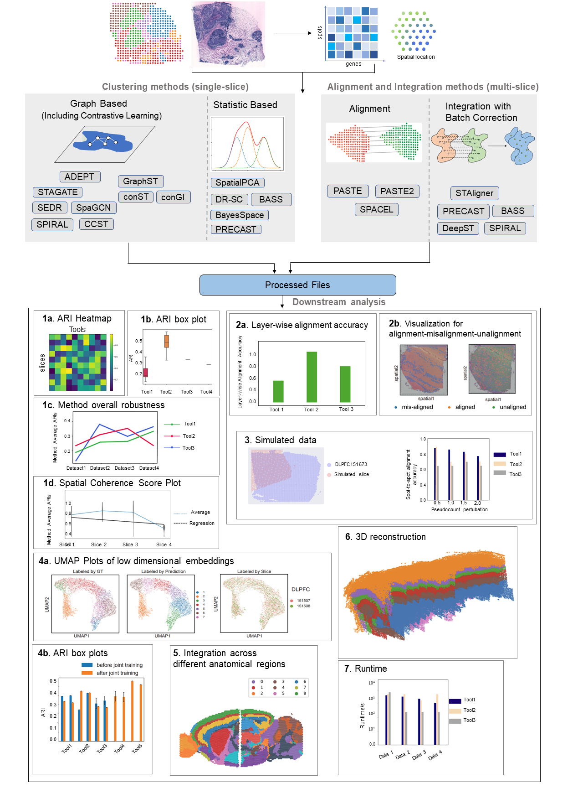

.. BenchmarkST documentation master file, created by
   sphinx-quickstart on Thu Sep 16 19:43:51 2021.
   You can adapt this file completely to your liking, but it should at least
   contain the root `toctree` directive.

BenchmarkST - reproducibility documentation
=============================================================================

.. toctree::
   :caption: Getting Started
   :maxdepth: 1

   Installation
   Data availability
   
   .. Get started
   .. =================

.. toctree::
   :caption: Clustering
   :maxdepth: 1

   BANKSY
   ADEPT
   GraphST
   SpaceFLow
   conST
   ConGI
   SpatialPCA
   DR-SC
   STAGATE
   CCST
   SEDR
   SpaGCN
   DeepST
   BayesSpace
   BASS_clustering
   PRECAST_clustering

   .. Clustering
   .. =================

.. toctree::
   :caption: Alignment
   :maxdepth: 1

   STalign
   GPSA
   PASTE
   PASTE2
   SPACEL
   
   .. alignmetn
   .. ==================

.. toctree::
   :caption: Integration
   :maxdepth: 1

   SPIRAL
   STAligner
   PRECAST_integration
   BASS_integration
   DeepST_integration
   
   .. Integration
   .. ==================

.. toctree::
   :caption: Data simulation
   :maxdepth: 1

   DLPFCsimulatedData
   
.. toctree::
   :caption: Analysis:
   :maxdepth: 1
   
   Clustering reproduce
   Integration reproduce
   3D reproduce
   

.. News
.. ========
.. online doc currently under development

.. TODO list
.. ========
.. docs for general installation guide (1/1) (github install + certain helper functions setup)

.. docs for data availability (1/1)

.. docs for clustering methods (14/14) (ccst data preparation part)

.. docs for integration methods (8/8)

.. docs for simulated data integration (done) 

.. docs for figure reproduction (0/3) (clustering + integration part reproduction)

Introduction
========
Spatial transcriptomics (ST) is advancing our understanding of complex tissues and organisms. 
However, building a robust clustering algorithm to define spatially coherent regions in a single tissue slice, and aligning or integrating multiple tissue slices originating from diverse sources for essential downstream analyses remain challenging. 
Numerous clustering, alignment, and integration methods have been specifically designed for ST data by leveraging its spatial information. The absence of benchmark studies complicates the selection of methods and future method development. 
We systematically benchmark a variety of state-of-the-art algorithms with a wide range of real and simulated datasets of varying sizes, technologies, species, and complexity. 
Different experimental metrics and analyses, like adjusted rand index (ARI), uniform manifold approximation and projection (UMAP) visualization, layer-wise and spot-to-spot alignment accuracy, spatial coherence score (SCS), and 3D reconstruction, are meticulously designed to assess method performance as well as data quality. 
We analyze the strengths and weaknesses of each method using diverse quantitative and qualitative metrics. 
This analysis leads to a comprehensive recommendation that covers multiple aspects for users.

Acknowledgement
========
We deeply appreciate for all the help that we have received from the authors of these fantastic algorithms!

Citation
========
Yunfei Hu, et al. "Benchmarking clustering, alignment and integration methods for spatial transcriptomics", currently under review
